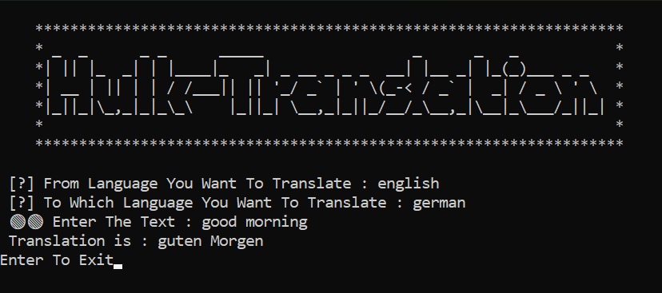
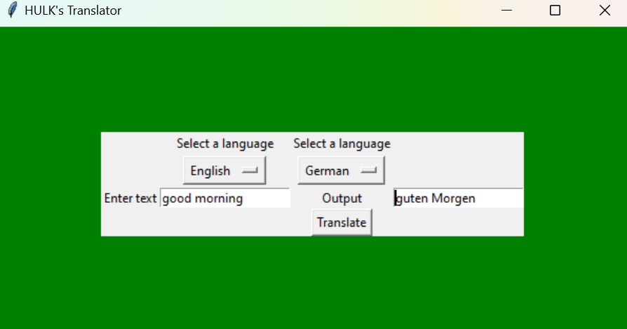

# Translator
## Author : Sumalya Chatterjee
##
## Cli Output :

##
## Gui Output :

##
## Git Installation :
```
# clone the repo
git clone https://github.com/R3DHULK/translator
# change directory
cd translator
# install requirements
python -m pip -r requirements.txt
# for cli result
python translator.py
# for gui result
python translator-gui.py
```
##
<h3 align="left">Support:</h3>
<p><a href="https://www.buymeacoffee.com/https://www.buymeacoffee.com/r3dhulk"> </a></p><br><br>
